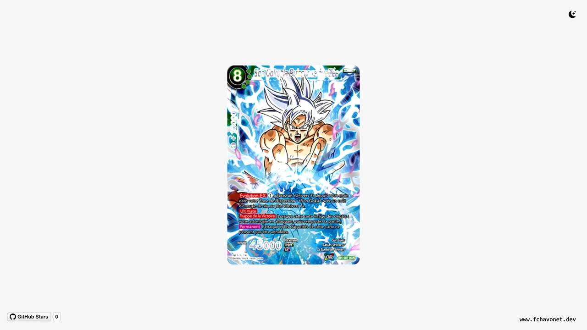

# DBSCG 3D Viewer

## Description

DBSCG 3D Viewer is a lightweight 3D card visualizer developed using web technologies, with a focus on interactive rendering through the Three.js library. The project draws inspiration from mobile card-based games, and aims to replicate the immersive feeling of viewing collectible cards in a digital 3D environment.

This project also serves as an introduction to Three.js, allowing for hands-on experimentation with 3D graphics, camera controls, lighting, and user interaction. While this viewer is a simplified version of its inspirations, it provides a solid foundation for future improvements and features.

Developed over the course of two days, the project demonstrates how modern web tools can be used to quickly prototype interactive 3D experiences directly in the browser.

## Objectives

- Recreate a 3D card viewer experience using web technologies.
- Learn the basics of Three.js and WebGL.
- Practice interactive 3D rendering with JavaScript.
- Deliver a lightweight and responsive UI.
- Keep the setup simple and easily extendable.

## Tech Stack


## File Description

| **FILE**     | **DESCRIPTION**                                     |
| :----------: | --------------------------------------------------- |
| `assets`     | Contains the resources required for the repository. |
| `index.html` | Main HTML structure for the project.                |
| `style.css`  | Styles and animations for the project.              |
| `script.js`  | Behavior script for interactivity.                  |
| `README.md`  | The README file you are currently reading 😉.       |

## Installation & Usage

### Installation

1. Clone this repository:
    - Open your preferred Terminal.
    - Navigate to the directory where you want to clone the repository.
    - Run the following command:

```
git clone https://github.com/fchavonet/creative_coding-dbscg_3d_viewer.git
```

2. Open the cloned repository.

### Usage

1. Open the `index.html` file in your web browser.

2. Click and drag to tilt the card.
   
3. Tap quickly to flip the card.

You can also test the project online by clicking [here](https://fchavonet.github.io/creative_coding-dbscg_3d_viewer/).

<p align="center">
    <picture>
        <source media="(prefers-color-scheme: dark)" srcset="./assets/images/screenshots/desktop_page_screenshot-dark.webp">
        <source media="(prefers-color-scheme: light)" srcset="./assets/images/screenshots/desktop_page_screenshot-light.webp">
        
    </picture>
</p>

## What's Next?

- Enhance prismatic holographic effects for greater realism and visual appeal.
- Integrate environment lighting to improve depth and material rendering.
- Add the ability to import custom front and back images directly into the viewer.
- Refine mobile interactions, including pinch-to-zoom.
- Consider migrating to React with Three Fiber for better scalability and component management.

## Thanks

- A big thank you to my friends Pierre and Yoann, always available to test and provide feedback on my projects.

## Author(s)

**Fabien CHAVONET**
- GitHub: [@fchavonet](https://github.com/fchavonet)
